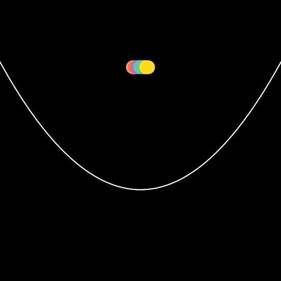
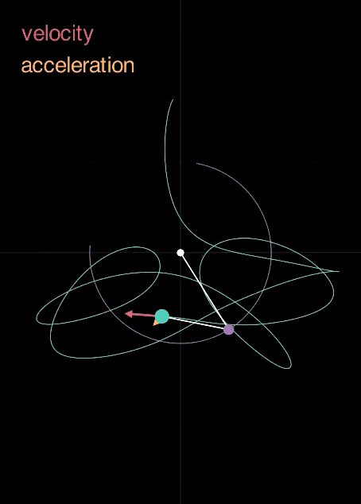
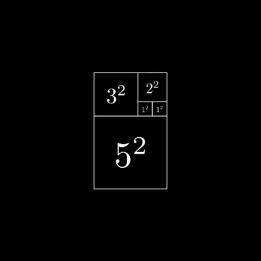
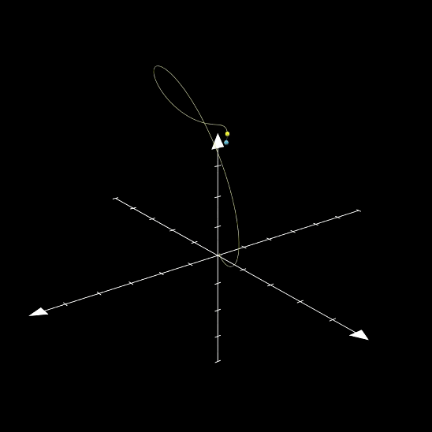
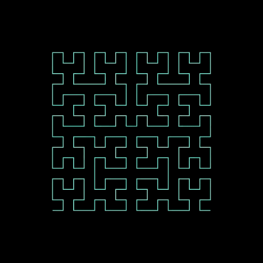
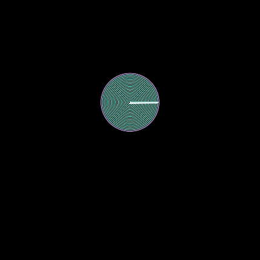

This repository contains various animations made with Manim. I shared some of them on [this](https://www.instagram.com/ibu_800/) Instagram page.

    

    

    

    

    

    

    

    

